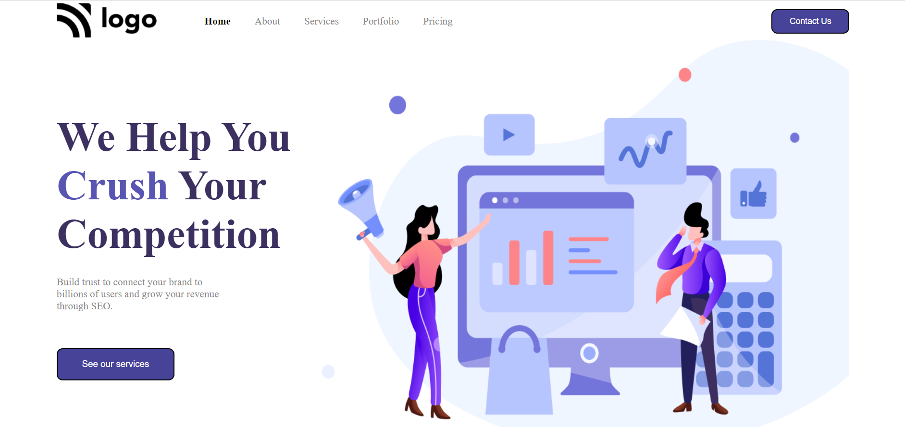

# **Digital Marketing Homepage**

>By Subrata

-----
#### Live Deployed Website : [here](https://streets-landingpage.netlify.app/)

---
### What I learned from this Project?

- This project was a very good learning experience for me.
- I learned how to use css position(Relative & Absolute) property.
- I learned about css flex property.
- I learned about adding image through CSS .

---
#### How the website looks ike
---

***

